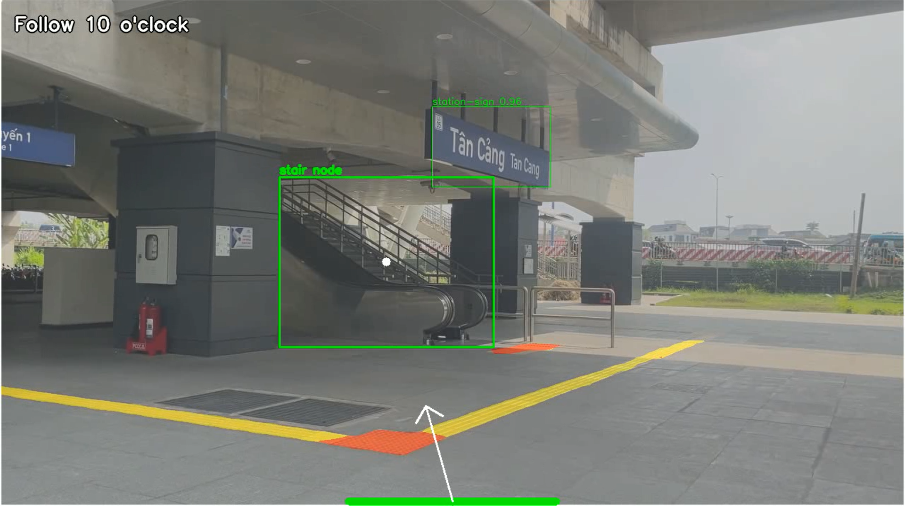
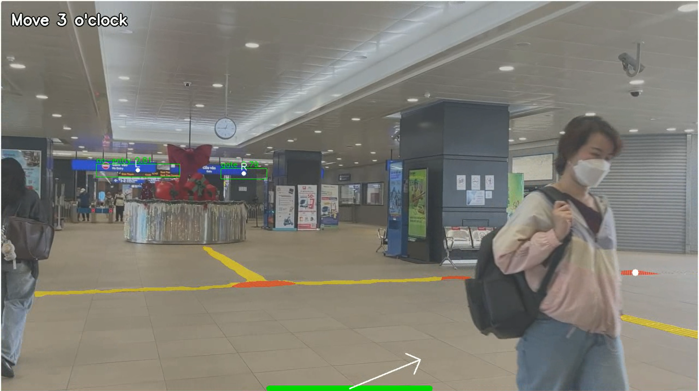
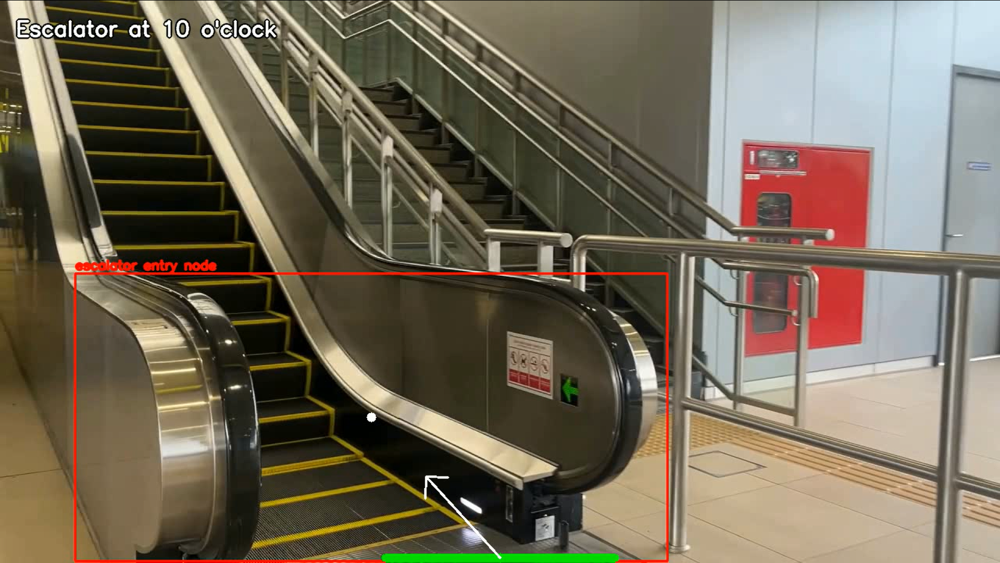
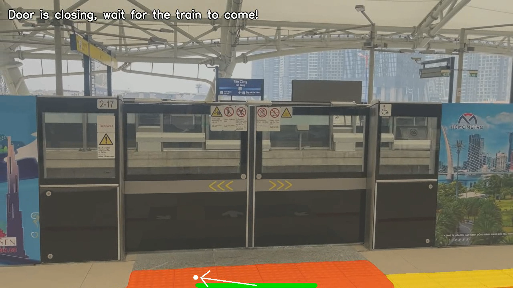

# Phase-Aware Metro Navigation Prototype

Research code for **“Computer Vision Based Navigation System for Visually Impaired People in Metro Station.”** The system combines:

- a YOLO11 detector for metro landmarks and warning-related objects;
- a second YOLO detector for station/sign classes and left–right sign relationships;
- SegFormer-B0 segmentation for `blindway` and `curb_ramp` regions; and
- a phase-aware guidance state machine that switches between safe-zone searching, tactile-path following, and destination/warning behavior.

> [!WARNING]
> This repository is a research prototype, not a certified mobility aid or safety system. It has not been validated for unsupervised public use. Do not use it as the sole navigation aid for a visually impaired person.


| SEARCHING                           | FOLLOWING                |
|-------------------------------------|--------------------------|
|  |  |

| WARNING                      | RESULT                 |
|------------------------------|------------------------|
|  |  |


## Repository status

This repository contains the **inference, fusion, visualization, and benchmarking code**. It does not yet contain the complete training pipeline, dataset, annotation protocol, or official evaluation split manifests. Therefore, it supports demonstration and code inspection, but it is not yet a fully reproducible research release. See [REPRODUCIBILITY.md](REPRODUCIBILITY.md) and the detailed [CODE_REVIEW_REPORT.md](CODE_REVIEW_REPORT.md).

## Main improvements in this cleaned version

- installable `src/` package with a command-line interface;
- typed configuration instead of machine-specific Windows paths;
- PEP 8-compatible formatting and Ruff configuration;
- dependency-light domain objects and testable fusion logic;
- monotonic route phases to prevent accidental backward phase changes;
- segmentation fallback when no reliable global landmark is visible;
- segmentation re-enabled after an escalator target disappears;
- one accepted speech message per frame to avoid instruction queue flooding;
- controlled repetition of unchanged guidance;
- all object detections retained even when an escalator is present;
- current-frame visualization instead of reusing a stale blended frame;
- streaming benchmarks that do not load the entire video into RAM;
- unit tests, CI configuration, Git LFS rules, citation metadata, and documentation.

## Project layout

```text
.
├── src/metro_navigation/
│   ├── core/fusion.py          # phase-aware guidance state machine
│   ├── models/                 # YOLO and SegFormer wrappers
│   ├── utils/                  # clock-direction and speech utilities
│   ├── benchmark.py            # streaming component benchmark
│   ├── config.py               # typed configuration
│   ├── domain.py               # shared result dataclasses/enums
│   ├── pipeline.py             # online/video processing loop
│   ├── visualization.py        # OpenCV rendering
│   └── cli.py                  # metro-nav command
├── models/weights/             # custom weights, normally managed with Git LFS
├── tests/                      # unit tests for geometry, temporal mode, and fusion
├── main.py                     # compatibility launcher
└── benchmark_components.py     # compatibility benchmark launcher
```

## Requirements

Recommended environment:

- Python 3.10 or 3.11;
- CUDA-capable PyTorch for real-time performance, or CPU for functional testing;
- a local text-to-speech backend supported by `pyttsx3`;
- Git LFS when model binaries are stored in the repository.

Create an environment and install the package:

```bash
python -m venv .venv

# Windows PowerShell
.venv\Scripts\Activate.ps1

# Linux/macOS
source .venv/bin/activate

python -m pip install --upgrade pip
python -m pip install -e ".[dev]"
```

## Model weights

The runtime expects these files by default:

```text
models/weights/yolo11m.pt
models/weights/segformer.pt
models/weights/yoloOCR.pt
```

The TensorRT files from the earlier prototype are not used by this PyTorch runtime and are intentionally excluded from the cleaned source bundle. Keep only artifacts that have a documented purpose and verified provenance.

Alternative paths can be supplied with command-line options:

```bash
metro-nav run \
  --source path/to/video.mp4 \
  --od-weights path/to/yolo11m.pt \
  --segmenter-weights path/to/segformer.pt \
  --sign-weights path/to/yoloOCR.pt
```

Environment variables are also supported:

```text
METRO_NAV_OD_WEIGHTS
METRO_NAV_SEGMENTER_WEIGHTS
METRO_NAV_SIGN_WEIGHTS
METRO_NAV_SEGMENTER_BACKBONE
```

## Run inference

Video input with display and speech:

```bash
metro-nav run --source path/to/video.mp4 --display
```

Camera input without speech:

```bash
metro-nav run --source 0 --display --no-speech
```

Save an annotated video and runtime CSV:

```bash
metro-nav run \
  --source path/to/video.mp4 \
  --output-video outputs/demo.mp4 \
  --runtime-log outputs/runtime.csv \
  --sample-every 300
```

The first tested route used route-specific station classes. The optional station announcement is therefore explicit rather than hard-coded:

```bash
metro-nav run --source path/to/video.mp4 --station-name "Tan Cang station"
```

## Benchmark

The benchmark reopens and streams the video for each component instead of retaining every frame in memory:

```bash
metro-nav benchmark \
  --source path/to/video.mp4 \
  --warmup 30 \
  --sign-every 8 \
  --output-directory outputs/benchmark
```

Generated files:

- `component_benchmark_summary.csv`
- `component_benchmark_raw.csv`

Display, video writing, and text-to-speech are excluded from benchmark timing.

## Quality checks

```bash
ruff format .
ruff check .
pytest
mypy src/metro_navigation
```

## Safety and technical limitations

The current state machine remains route-specific in several places, especially sign labels and left/right constraints. Reported performance from a limited, less-crowded test route does not establish safety under dense crowds, occlusion, construction changes, reflective floors, rain, temporary signage, or unseen stations. Pixel accuracy and mIoU also do not directly measure end-to-end navigation safety. A deployable system would additionally need obstacle avoidance, uncertainty handling, fail-safe behavior, human-subject validation, latency-tail analysis, accessibility testing, and formal hazard/risk management.


